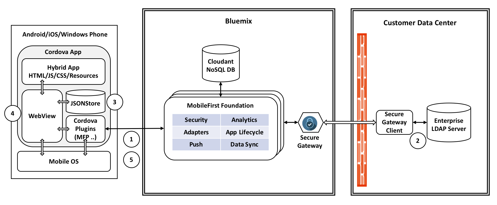

# MobileFoundation-Ionic-OnPremiseLDAP

1. User launches the app, enters his/her credentials in the login page and clicks *Login*. Credentials are sent to the MobileFirst adapter for authentication.
2. MobileFirst adapter makes a call to the enterprise LDAP server through Secure Gateway to validate user credentials.
3. If authentication is successful, the credentials are stored securely in the JSONStore for later offline authentication, and the app proceeds to show the secure content to user.
4. At a later time when the device is offline, user launches the app again, enters his/her credentias in the login page and clicks *Login*. Since the device if offline, instead of making a call to MobileFirst adapter, the app attempts to authenticate the user through the local JSONStore. If authentication is successful, the app proceeds to show the secure content to user.
5. During a subsequent login attempt when the device has network connectivity, user is authenticated by making calls all the way up to enterprise LDAP server. If authentication is successful, the JSONStore is updated with current credentials. This takes care of any updates made to user credentials (like password) in enterprise LDAP server during further offline login attemtps.
